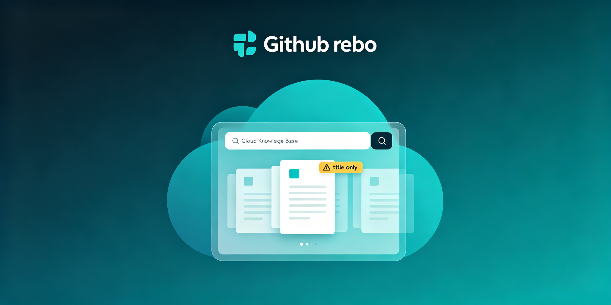

# ima-knowledge-base

**腾讯 ima 知识库 API 操作：检索/读取/订阅库。**

  

[能力边界](#能力边界) · [凭据](#凭据)

---

## 能力边界

| 能力 | 状态 |
|------|------|
| 知识库搜索（标题级） | ✅ |
| 文件列表（标题级） | ✅ |
| 正文全文检索 | ❌（别浪费时间） |
| 文件内容读取 | ❌（220030 无权限） |

## 凭据

- Client ID + API Key：https://ima.qq.com/agent-interface
- 存 `~/.config/ima/`，chmod 600
- API 调用：`node ima_api.cjs <path> <jsonBody>`（位置参数，不是 flag）

## License

MIT
